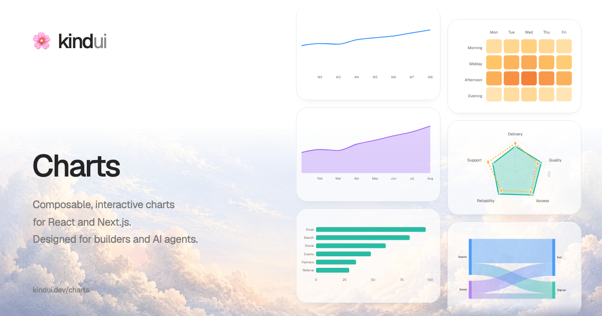

# Kind UI

Composable, interactive charts for React and Next.js. Designed for builders and AI agents.

[Chart gallery](https://kindui.dev/charts) · [Documentation](https://kindui.dev/charts/docs/) · [npm package](https://www.npmjs.com/package/@kind-ui/charts)

[](https://kindui.dev/charts)

[](https://www.npmjs.com/package/@kind-ui/charts)
[](https://www.npmjs.com/package/@kind-ui/charts)
[](https://github.com/bhaveshchow20/kind-ui/actions/workflows/ci.yml)
[](https://github.com/bhaveshchow20/kind-ui/actions/workflows/docs.yml)
[](LICENSE)
[](https://deepwiki.com/bhaveshchow20/kind-ui)

[Get started](#get-started) · [Explore charts](#explore-charts) · [AI agents](#ai-agents) · [Contribute](#contribute)

Kind UI Charts (`@kind-ui/charts`) is an open-source data visualization library with typed, composable components. Start with a complete example, then adapt your data, styling and interactions.

- **Compose your chart:** control axes, series, tooltips and legends through public TypeScript APIs
- **Shape the experience:** customize colors, materials, animation, loading states and visibility
- **Build accessibly:** use named charts, keyboard interactions and complete data alternatives

## Get started

Install the package:

```sh
npm install @kind-ui/charts
```

Import the components you need and load the stylesheet once at your application entry:

```tsx
import { LineChart } from "@kind-ui/charts";
import "@kind-ui/charts/styles.css";
```

In Next.js, load the stylesheet in your root layout and render interactive charts in a client component. Check the [installation guide](https://kindui.dev/charts/docs/installation/) for required peer dependencies.

Copy a [complete line chart example](https://kindui.dev/charts/docs/components/line/), including its data and accessible table. The [package reference](packages/charts/README.md) covers API defaults and limits.

## Explore charts

Browse 13 chart families, with complete examples and code in the documentation:

| Use case | Chart guides |
| --- | --- |
| Trends and comparisons | [Line](https://kindui.dev/charts/docs/components/line/) · [Area](https://kindui.dev/charts/docs/components/area/) · [Bar](https://kindui.dev/charts/docs/components/bar/) · [Combo](https://kindui.dev/charts/docs/components/combo/) |
| Parts and progress | [Pie / Donut](https://kindui.dev/charts/docs/components/pie/) · [Radar](https://kindui.dev/charts/docs/components/radar/) · [Radial / Activity rings](https://kindui.dev/charts/docs/components/radial/) |
| Relationships and distributions | [Scatter / Bubble](https://kindui.dev/charts/docs/components/scatter/) · [Heatmap](https://kindui.dev/charts/docs/components/heatmap/) · [Histogram](https://kindui.dev/charts/docs/components/histogram/) · [Box plot](https://kindui.dev/charts/docs/components/box-plot/) |
| Flow and change | [Sankey](https://kindui.dev/charts/docs/components/sankey/) · [Waterfall](https://kindui.dev/charts/docs/components/waterfall/) |

Explore [materials](https://kindui.dev/charts/docs/guides/materials/), [motion](https://kindui.dev/charts/docs/guides/motion/) and [accessibility](https://kindui.dev/charts/docs/guides/accessibility/) when adapting an example.

## AI agents

Install the Kind UI consumer skill:

```sh
npx skills add bhaveshchow20/kind-ui --skill kind-ui-charts
```

Start with the [documentation index](https://kindui.dev/charts/docs/llms.txt) and [agent consumer guide](https://kindui.dev/charts/docs/markdown/agents/consumer.md). Use the [complete reference](https://kindui.dev/charts/docs/llms-full.txt) when you need all documentation in one file. Each chart guide includes example setup files and prompts.

## Contribute

See [CONTRIBUTING.md](CONTRIBUTING.md) for setup and checks. Local development requires Node 22.12+ and npm 11.9.

[Changelog](packages/charts/CHANGELOG.md) · [Release policy](docs/development.md) · [Security reporting](SECURITY.md) · [Code of Conduct](CODE_OF_CONDUCT.md)

Created by [Bhavesh Chowdhury](https://github.com/bhaveshchow20). Free to use under the [MIT license](LICENSE).
